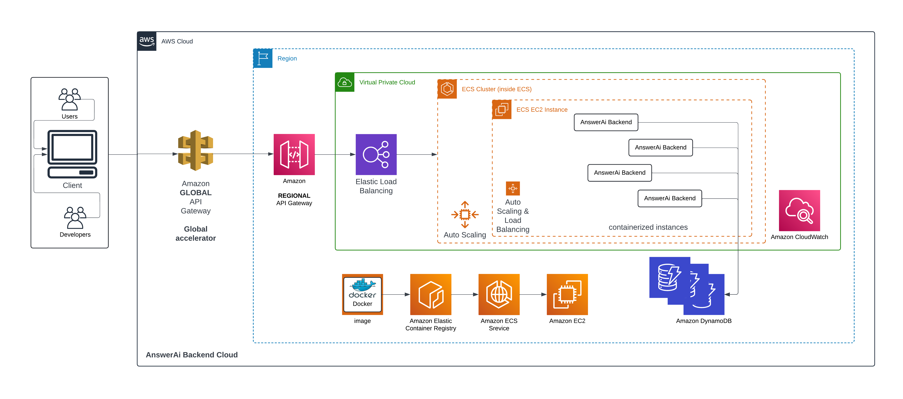

# 🌟 AnswerAi Backend Service 🌟

Welcome to the Backend Service! This service, built with Node.js and Express.js, is designed to handle user requests and generate AI-powered answers. It's secure, scalable, and ready to integrate with a frontend application.

## 🚀 Features

- **User Management:** Create and manage user accounts.
- **AI Integration:** Generate answers using AI.
- **Authentication & Authorization:** Secure endpoints with JWT.
- **Scalability:** Designed to handle a large number of concurrent users.
- **Dockerized:** Easy deployment with Docker.

## 📋 Table of Contents

- [Prerequisites](#-prerequisites)
- [Environment Variables](#-environment-variables)
- [Installation](#-installation)
- [Running the Application](#-running-the-application)
- [Running Tests](#-running-tests)
- [Docker Setup](#-docker-setup)
- [API Endpoints](#-api-endpoints)
- [Architecture Diagram](#-architecture-diagram)

## 🛠 Prerequisites

Make sure you have the following installed:

- [Node.js](https://nodejs.org/)
- [Docker](https://www.docker.com/)

- [MongoDB](https://www.mongodb.com/) -- If you want to set up the DB locally
    OR
- [MongoDB Atlas](https://www.mongodb.com/products/platform/atlas-database) --If you want to set up the DB on Cloud for free

## 🔧 Environment Variables

Create a `.env` file in the root directory and add the following:
```bash
MONGO_URI=<Your MongoDB URI>
JWT_SECRET=<Your JWT Secret>
OPENAI_API_KEY=<Your OpenAI API Key>
PORT=5003
```

## 📦 Installation

Clone the repository and install dependencies:
```bash
git clone https://github.com/coderavdhesh/Avdhesh-Gupta-AnswerAi-Backend.git
cd path/to/Avdhesh-Gupta-AnswerAi-Backend
npm install
```

## 🏃 Running the Application locally

Start the application:
```bash
npm src/app.js
```
The server will run on http://localhost:5003, locally on your laptop.

## ✅ Running Tests

Run the tests using Jest:
```bash
npm test
```

## 🐳 Docker Setup

Build the Docker Image of the DockerFile:

```bash
docker build -t answerai-backend .
```

Run the Docker container(deploy the app locally):
```bash
docker run -p 5003:5003 answerai-backend
```

## 🐳 Docker Compose Setup (Best for the multiple DockerFiles)

Build the Docker Image of the DockerFile, using Docker compose:

```bash
docker compose build
```

Run the Docker container(deploy the app locally):
```bash
docker run -p 5003:5003 answerai-backend
```

Run the Docker container(to run the unit test cases):
```bash
docker compose run -t tests
```


## 📚 API Endpoints

- **Auth**
```bash
POST /api/auth/login  : Login a user.
POST /api/auth/logout  : Logout a user.
POST /api/auth/refresh  : Refresh access token.
```

- **Users**
```bash
GET /api/users  : to reteive all the users in the database
POST /api/users/newUser  : Create a new user account.
GET /api/users/:userId  : Retrieve a user profile.
GET /api/users/:userId/questions  : To retrive all the question of the specific user
```

- **Questions**
```bash
POST /api/questions: Accept user question and return AI-generated answer.
GET /api/questions/:questionId: Retrieve a specific question and answer by question ID.
```

## 🏗 Architecture Diagram

Below is a high-level architecture diagram of the service:



## 📖 License

This project is licensed under the MIT License. See the LICENSE file for details.
